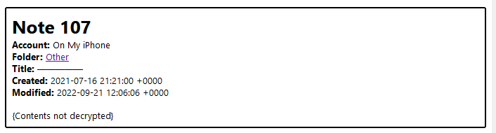

There is a note in Apple Notes on my phone that I cannot open.

The note is not mission critical (gift ideas for my family members), but I would like to have access to it again. I created the note September 21, 2022 and at some point thought it would be funny to put an additional password on a note that contains such trivial information. Some time in the last 6 months, something changed with the note. I used to be able to use TouchID to unlock it, but it began prompting me for a password. Having set it more than a year prior and never having entered it again (to my recollection), I could not remember what it was. I tried all the simple "dumb" passwords I use when temporarily setting up user accounts, but could not get in.

What is a hacker to do when they've forgotten their own password? 

I started searching online for guides on how to "crack apple notes password". I found that [hashcat](https://hashcat.net/hashcat/) has support for cracking "Apple Secure Notes" hashes. I am very familiar with hashcat so this was great news, but I didn't know how to extract a hash from my iPhone - this sounded like something that would require a jailbroken phone.

Eventually I came across [this in-depth research](https://www.ciofecaforensics.com/2020/07/31/apple-notes-revisited-encrypted-notes/) into Apple Notes encryption by Jon Baumann of Ciofeca Forensics. The article introduces a tool called [Apple Cloud Notes Parser](https://github.com/threeplanetssoftware/apple_cloud_notes_parser) which ingests an iPhone backup (made by iTunes) and produces plaintext files of all the contained Apple Notes. One of the flags it has is `--password-file` - this is a file of passwords to try when decrypting any encrypted notes.

I already had a full local backup of my phone, but I encrypt my backups so I had to disable this option and run a new full backup. This took quite a while as the backup was 200GB (256GB capacity iPhone). After it had finally completed, I ran the parser script without any password-file to see what would happen. The tool creates a whole bunch of files including HTML versions of each note, extracted images, and a `NoteStore.sqlite` database.

```
│ debug_log.txt
│ Manifest.db
│ notes.sqlite
│ NoteStore.sqlite
├───csv
│       note_store_accounts_1.csv
│       note_store_accounts_2.csv
│       note_store_cloudkit_participants_1.csv
│       note_store_cloudkit_participants_2.csv
│       note_store_embedded_objects_1.csv
│       note_store_embedded_objects_2.csv
│       note_store_folders_1.csv
│       note_store_folders_2.csv
│       note_store_notes_1.csv
│       note_store_notes_2.csv
├───files
│   ├───Media
│   │   └───F0FC4CFE-E5A9-4F7E-BF3C-3425B06A55BF
│   │           B6BB473B-02E1-4990-8769-185D2E78EDC1.jpg
│   └───Previews
│           19239C6C-864E-4A28-9220-696E81B421B3-1-768x768-1.png
├───html
│       all_notes_1.html
│       all_notes_2.html
└───json
        all_notes_1.json
        all_notes_2.json
```

I looked for the encrypted note contents, but the parser of course didn't know what to do with it.



Trying again to recall my password, I figured that I had probably used a dumb password since the note was not important. Chances were pretty good I had used that password for things like temporarily spinning up services in my homelab. If I had, there was a chance it was saved in my 1Password vault so I exported all the account data from my 1Password account to a CSV, then used [`miller`](https://github.com/johnkerl/miller) to filter down to just the passwords.

```sh
mlr --csv cut -f Password 1PasswordExport.csv >> passwords.txt
```

I re-ran `apple_cloud_notes_parser` with the password file but had no luck.

At this point my thoughts turned towards traditional password cracking. How could I extract a hash from this backup that I could then feed to a cracking tool? As usual, it turns out there's a john script for that: [`applenotes2john.py`](https://github.com/openwall/john/blob/bleeding-jumbo/run/applenotes2john.py). This worked perfectly to extract a John-compatible hash from `NoteStore.sqlite`, but I am much more experienced with using hashcat so I tried pointing hashcat at it but got an error message about the hash format. 

I tried changing the hash to match the example listed on the [`example_hashes`](https://hashcat.net/wiki/doku.php?id=example_hashes) page, but couldn't get past the `Separator unmatched` error.

To make sure the hash was valid, I then downloaded a binary of John which had no trouble with it. To crack the password, I opted for a Mask Attack. I figured that I probably set a really simple password of between 4 and 6 characters of alphanumeric and maybe 1 or 2 special characters. I launched a test run:

```
.\john.exe --mask='?a?a?a?a' H:\Sync\hashes.txt
```

One of the advantages of john over hashcat is the commands are generally much shorter. I was soon reminded why I never use John on this machine - it doesn't seem to recognize my GPU (Nvidia 1050 Ti) even with Cuda installed. It's probably user error, but as a result John listed an ETA of 15 hours to run through the 4-character keyspace using only the CPU (Ryzen 5 1600).

I started searching to see how to enable Nvidia GPU support for John, but a lot of the articles I found involved recompiling it from source or copying DLLs around my system. At this point it was around 1AM and I figured I'd just let John chug through the night and take another run at making hashcat work in the morning

The next day I checked the progress and John was patiently waiting with a prize:

```
>.\john.exe --mask='?a?a?a?a' H:\Sync\hashes.txt
Warning: detected hash type "notes", but the string is also recognized as "notes-opencl"
Use the "--format=notes-opencl" option to force loading these as that type instead
Using default input encoding: UTF-8
Loaded 1 password hash (notes, Apple Notes [PBKDF2-SHA256 AES 256/256 AVX2 8x])
Cost 1 (iteration count) is 20000 for all loaded hashes
Will run 12 OpenMP threads
Press 'q' or Ctrl-C to abort, almost any other key for status
0g 0:00:12:37 1.36% (ETA: 15:00:18) 0g/s 1458p/s 1458c/s 1458C/s 0xge..mLge
0g 0:00:19:00 2.02% (ETA: 15:10:58) 0g/s 1441p/s 1441c/s 1441C/s py:e..fu:e
asdf             (NoteStore.sqlite)
1g 0:05:12:35 DONE (2024-03-02 04:42) 0.000053g/s 1425p/s 1425c/s 1425C/s 5ndf..u0df
Use the "--show" option to display all of the cracked passwords reliably
Session completed
```

Wow, the password I chose was even dumber than I thought!

Out of curiosity, I looked back at my attempts to use hashcat and realized the other dumb mistake I made - I had mistakenly used mode `-m 16500` (JWT - JSON Web Token) instead of `-m 16200`  (Apple Secure Notes) 🤦. I corrected the mistake and hashcat proceeded to crack the hash in 6(!) minutes using the GPU.

```
> .\hashcat.exe -m 16200 H:\Sync\hashes_hc.txt --session apple-notes --status -w 3 -a 3 "?a?a?a?a"
hashcat (v6.2.6) starting

...

$ASN$*107*20000*86e7184911aa4090f24d7e701b5c6b05*ddfde252d699d22125c1089338f097f529e79fd2f8acb576:asdf
Session..........: apple-notes
Status...........: Cracked
Hash.Mode........: 16200 (Apple Secure Notes)
Hash.Target......: $ASN$*107*20000*86e7184911aa4090f24d7e701b5c6b05*dd...acb576
Time.Started.....: Sat Mar 02 09:05:25 2024 (6 mins, 24 secs)
Time.Estimated...: Sat Mar 02 09:11:49 2024 (0 secs)
Kernel.Feature...: Pure Kernel
Guess.Mask.......: ?a?a?a?a [4]
Guess.Queue......: 1/1 (100.00%)
Speed.#1.........:    18628 H/s (66.29ms) @ Accel:4 Loops:1024 Thr:1024 Vec:1
Recovered........: 1/1 (100.00%) Digests (total), 1/1 (100.00%) Digests (new)
Progress.........: 7151616/81450625 (8.78%)
Rejected.........: 0/7151616 (0.00%)
Restore.Point....: 73728/857375 (8.60%)
Restore.Sub.#1...: Salt:0 Amplifier:5-6 Iteration:19456-19999
Candidate.Engine.: Device Generator
Candidates.#1....: a2jm -> a+(0
Hardware.Mon.#1..: Temp: 82c Fan: 49% Util:100% Core:1670MHz Mem:3504MHz Bus:16
Started: Sat Mar 02 09:05:21 2024
Stopped: Sat Mar 02 09:11:50 2024
```

I punched in the password and was greeted with my years old list of christmas gift ideas which I will not share here because they're classified. Success!