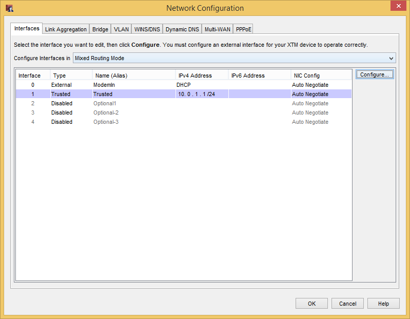
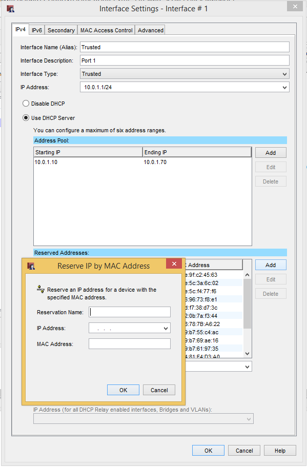
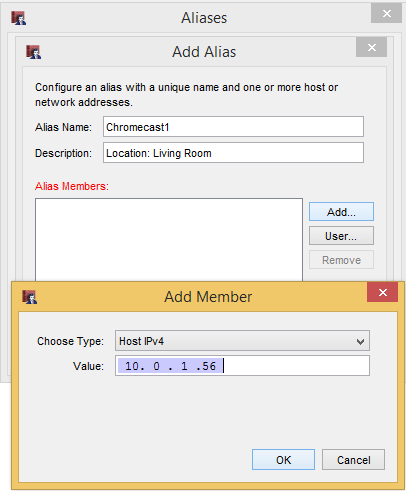
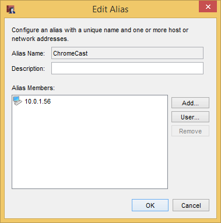
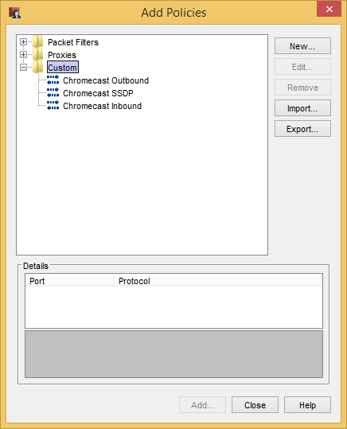
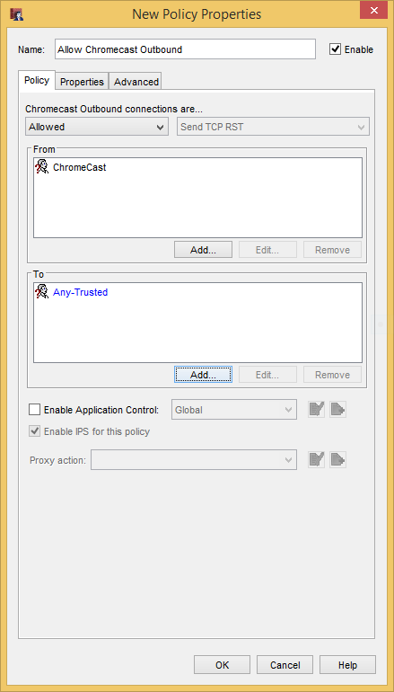
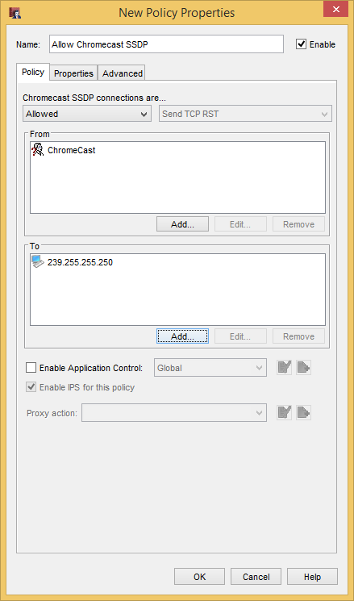

+++
author = "Dan Salmon"
categories = ["homelab"]
date = 2017-08-26T21:44:08Z
description = ""
draft = false
slug = "allow-a-chromecast-through-a-watchguard-firewall"
tags = ["homelab", "networking"]
title = "Allow a Chromecast through a WatchGuard firewall"
type = "post"

+++

# Background
I recently picked up a Chromecast for my TV so I could stream Netflix easier since [XBMC’s addon](http://forum.kodi.tv/showthread.php?tid=211574) is terrible if you don’t want to use a keyboard. It was super easy to setup, but after it updated and connected to my WiFi I couldn’t see it from my phone.  I did some digging and found that my WatchGuard 25W was the culprit.  After I added an any-any rule I was able to see it, but that left it wide-open on my network. This wouldn’t do. I did some looking around on the net and found [this great write-up](https://blog.g3rt.nl/allow-google-chromecast-host-firewall-iptables.html) by Gert van Dijk detailing the rules needed when using iptables.

* Allow high UDP ports both incoming and outgoing.
“High ports” are the local ports usually ranging 32768-61000 on most Linux systems.
* Allow both TCP ports 8008 and 8009 outbound to the Chromecast device.
I’ve noticed most reference only use 8008, but that didn’t do it for me and saw outbound connection to port 8009 being blocked.
* Allow the special SSDP packets outbound (which is UDP traffic to the multicast IP 239.255.255.250, destination port 1900).
As far as I understand, a Chromecast app should send information over SSDP if it wants to discover the Chromecasts in the network. The Chromecast should then reply to the source IP it was given.

This is the only part I needed to know to make a WatchGuard rule.

# Step 1 – Make a DHCP reservation

In Policy Manager, go to "Network > Network Configuration". Highlight whichever interface the DHCP server is running on and hit “Configure…”

In the Interface Settings window, click “Add” in the Reserved Addresses section and enter the appropriate information.

OK to everything until you get back to Policy Manager.

# Step 1.5 (Optional) – Make an alias

This step is optional, thought I would highly recommend doing it. It will help make your network and rules easier to manage later.

Like always, we start in Policy Manager. From there, hit "Setup > Aliases > Add..”. Name it something useful like “Chromecast1”. Make sure the “Type” is set to “Host IPv4” and enter the IP that we reserved below that.

Again we “OK” everything until we get back to Policy Manager. From now on, if we ever decide to change the network addressing scheme, we just have to change the IP in the alias and be done. No editing of policies necessary.

# Step 2 – Make a New Policy Template

You can download a .zip of the templates [from GitHub here](https://github.com/sa7mon/watchguard-chromecast/releases/download/0.2/PolicyTemplates.zip) or create them manually. After you unzip the file, open the Add Policies dialog and “Import…”.

If it asks if you want to overwrite or append, choose Append or you will lose all existing policy templates. Either way, you should end up with some custom policy templates that look like this:
<table>
    <tr>
        <td><strong>Name</strong></td>
        <td><strong>Port</strong></td>
        <td><strong>Protocol</strong></td>
    </tr>
    <tr>
        <td>Allow Chromecast Outbound</td>
        <td>32768-61000</td>
        <td>TCP</td>
    </tr>
    <tr>
        <td></td>
        <td>8008-8009</td>
        <td>TCP</td>
    </tr>
    <tr>
        <td>Chromecast SSDP</td>
        <td>1900</td>
        <td>UDP</td>
    <tr>
        <td>Chromecast Inbound</td>
        <td>32768-61000</td>
        <td>UDP</td>
    </tr>
</table>

# Step 3 – Create Policies

We’re going to make 1 rule from each template starting with “Allow Chromecast Outbound”.

In the “Add Policies” window still highlight the “Allow Chromecast Outbound” and click “Add…”. After that, change the Name to something meaningful, change the “From” to our “Chromecast” alias, and change the “To” to Any-Trusted (assuming the Chromecast is on the Trusted network).

Repeat the steps with the “Chromecast Inbound” policy template, but changing the “From” to Any-Trusted and the “To” to the Chromecast alias. Again, this assumes that the Chromecast is on the Trusted network.

The last policy to create is the Chromecast SSDP policy. This one I don’t fully understand but is related to Simple Service Discovery Protocol, a relative to UPnP.  Add a policy using the “Chromecast SSDP” template, change the “From” to our Chromecast alias, and change the “To” to 239.255.255.250 (Add Other..>Host IPv4)

# Step 4 – Save and Enjoy

After adding all 3 policies, just save your config to your Firebox and wait about a minute. You should be able to discover your Chromecast now from the app and start casting to it.  If you still can’t see it, you may have another firewall on your network interfering or the Chromecast is connected to the Optional network.