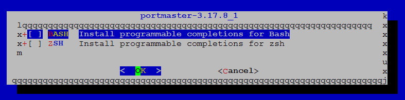
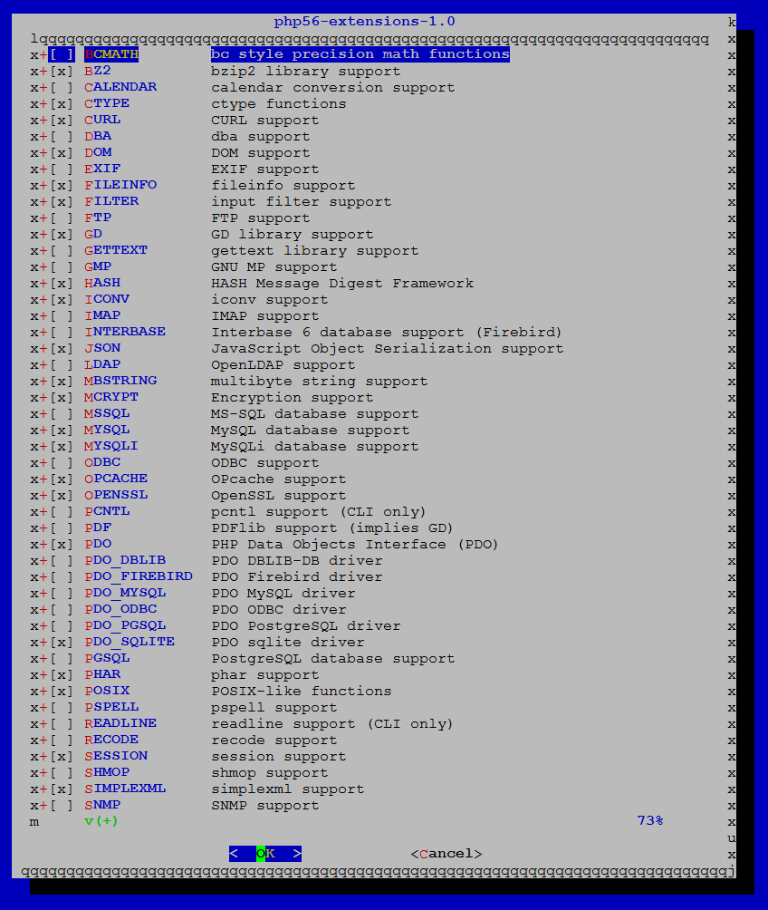
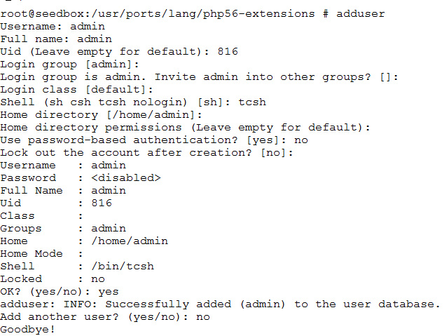

+++
author = "Dan Salmon"
date = 2017-08-16T04:33:52Z
description = "Create a seedbox with rTorrent in a FreeNAS jail"
draft = false
tags = ["freenas"]
slug = "create-seedbox-jail-freenas"
title = "Create a Seedbox Jail in FreeNAS with rTorrent / ruTorrent / lighttpd"
type = "post"
+++

# Intro / Credits
After much work and starting from scratch a few times, I finally got a working jail put together that uses ruTorrent, rTorrent, and Lighttpd to create a very nice personal seedbox in FreeNAS.  I should give a lot of credit to [FlyingPersian](https://forums.freenas.org/index.php?members/flyingpersian.36669/) and [his thread on the FreeNAS forum](https://forums.freenas.org/index.php?threads/how-to-install-rutorrent-with-lighttpd.28641/) for the great information. I’m going to shamelessly steal a lot of his guide but correct some things and add improvements that I found.

# Instructions

**1. Update all the things. This may take a while, so get comfy**

```bash
portsnap fetch
portsnap extract
pkg update
pkg upgrade
pkg install git
cd /usr/ports/ports-mgmt/portmaster
make install clean
echo "WITH_PKGNG=yes" >> /etc/make.conf
pkg2ng
portmaster -avB
```
Accept all the defaults



If you come to a screen like this, just hit enter to accept the defaults

**2. Install screen, lighttpd, text editor.**

I’m going to use ee, but you can install nano or any other text editor you like.
```bash
pkg install lighttpd
cd /usr/ports/sysutils/screen
make install clean
```
(Accept all defaults)

**3. Install rTorrent**
```bash
cd /usr/ports/net-p2p/rtorrent
make install clean
```
(Accept all defaults)

**4. Install PHP**

Make sure you do php56, not php53.
```bash
cd /usr/ports/lang/php56 
make install clean
```
(Accept all defaults)

**5. Install PHP Extensions**

```bash
cd /usr/ports/lang/php56-extensions
make install clean
```

There will be a big page of options, make sure the following are checked: (Some already will be)
BZ2,  CTYPE, CURL, DOM, FILEINFO, FILTER, GD, HASH, ICONV, JSON, MBSTRING, MCRYPT, MYSQL, MYSQLI, OPENSSL, PDO, PDO_SQLITE, POSIX, SESSION, SIMPLEXML, SOCKETS, SQLITE3, TOLKENIZER, XML, XMLREADER, XMLRPC, XMLWRITER, ZIP

After that process starts, it’s going to take a while and prompt you about 15 times. Just hit <enter> for the defaults on all of them.

**6. Create a user**

For the rest of the guide, I’m going to assume the user we’re setting this up for is named ‘admin’, but you can use whatever name you want.

**TIP**: If you’re going to be integrating this seedbox with SickRage at all, make sure to create your seedbox user with the UID of 816. This will avoid a lot of permissions issues.



**7. Create config files**

```bash
cp /usr/local/etc/php.ini-production /usr/local/etc/php.ini
cp /usr/local/share/examples/rtorrent/rtorrent.rc /home/admin/.rtorrent.rc
chown admin:admin /home/admin/.rtorrent.rc
```

**8. Create rTorrent’s folders**

```bash
cd /home/admin
mkdir rtorrent
cd rtorrent
mkdir .session
mkdir downloads
mkdir watch
chown -R admin:admin /home/admin
```

**9. Configure rTorrent**
Change the following lines in */home/admin/.rtorrent.rc*

```bash
# Default directory to save the downloaded torrents.
directory = /home/admin/rtorrent/downloads

# Default session directory. Make sure you don't run multiple instance
# of rtorrent using the same session directory. Perhaps using a
# relative path?
session = /home/admin/rtorrent/.session/

# Port range to use for listening.
port_range = 50001-50001
```

Add the following line to the bottom of the file
```bash
scgi_port = 127.0.0.1:5001
```

All of the other settings can be changed later through the ruTorrent GUI.

**10. Download ruTorrent and plugins**

```bash
mkdir /usr/local/www
cd /usr/local/www
git clone https://github.com/Novik/ruTorrent.git
mv ruTorrent/ rutorrent
chown -R admin:admin rutorrent
```

While we’re here, let’s edit */usr/local/www/rutorrent/conf/config.php* and change the port on line 30 to:

```bash
$scgi_port = 5001;
```

**11. Edit lighttpd config**

I’m not going to configure SSL, since I couldn’t get it working without breaking everything. Arguably, there’s also no need for it if this jail isn’t going to be public internet-facing. Check the above referenced forum post if you want to do that.

Edit */usr/local/etc/lighttpd/lighttpd.conf* to:
```bash
server.document-root = "/usr/local/www/rutorrent"
```

Then, to password-protect the GUI add the following lines to the end of the file:

```bash
auth.backend = "htpasswd"
auth.backend.htpasswd.userfile = "/etc/private/.htpasswd"
auth.require = (
        "/RPC2" => (
                "method" => "basic",
                "realm" => "My Seedbox",
                "require" => "user=admin",
         ),
         "/" => (
                "method" => "basic",
                "realm" => "My ruTorrent web site",
                "require" => "valid-user",
          )
)
```

For “realm”, you can put whatever you want or change it later. This is the message that will show when the login box pops up.

**12. Create .htpasswd for authentication**

```bash
mkdir -p /etc/private
cd /etc/private
ee .htpasswd
```

Go to this site, enter whatever password you want to use and hit generate. Your password file will contain only one line: username:htpasswd so in my example using the password “password” my file would look like this:

```bash
admin:cGyUX9QugYMgE
```

**13. Configure lighttpd with FastCGI**
Edit */usr/local/etc/lighttpd/modules.conf* and uncomment the following lines:

```bash
Around line 45: 
"mod_auth", 

Around line 132: 
include "conf.d/fastcgi.conf"
```

Now we need to edit */usr/local/etc/lighttpd/conf.d/fastcgi.conf* and add the following lines to the bottom of the file:

```bash
fastcgi.server = ( ".php" => ((
    "bin-path" => "/usr/local/bin/php-cgi",
                  "socket" => "/tmp/php.socket",
                  "max-procs" => 1,
                  "bin-environment" => (
                         "PHP_FCGI_CHILDREN" => "3",
                         "PHP_FCGI_MAX_REQUESTS" => "1000"
                  ),
                  "bin-copy-environment" => (
                         "PATH", "SHELL", "USER"
                  ),
                  "broken-scriptfilename" => "enable"
                 )))
```

**14. Make lighttpd start on jail startup**
```bash
sysrc lighttpd_enable=yes
```

**15. Make rTorrent start on jail startup**
After switching to admin with “su admin”, create */home/admin/rtorrent.sh* and give it the following contents:

```bash
#!/bin/sh
PATH=/etc:/bin:/sbin:/usr/bin:/usr/sbin:/usr/local/bin
export TERM=xterm
# Start rtorrent in detached screen
screen -dmS screen_rtorrent rtorrent
```

Change permissions on our new file:

```bash
chmod 777 /home/admin/rtorrent.sh
```

Then run:
```bash
crontab -e
```

and add the following lines:

```bash
SHELL=/bin/sh
PATH=/etc:/bin:/sbin:/usr/bin:/usr/sbin
@reboot /home/admin/rtorrent.sh
```

For those unfamiliar with vi, this site may help.
That should do it! Restart your jail through the FreeNAS GUI and log in through your web browser. If you’re not seeing a green checkmark in the bottom bar, you may need to forward a port through your firewall/router. Sometimes rTorrent will still work just fine without this, though.
 

# Problems/Solutions
Here are some problems that I ran into and the fixes I found for them.

**Problem:** When I navigate to the jail’s IP I get this message: ERR_CONNECTION_REFUSED
**Solution:** You forgot Step 14

**Problem:** When I log into ruTorrent, I got a bunch of the following errors:
* Webserver user doesn’t have read/write/execute access to the torrents directory. You cannot add torrents via ruTorrent.
* Webserver user doesn’t have read/write/execute access to the settings directory. ruTorrent settings cannot be saved.
* rTorrent user must have read/execute access to the torrents directory. You cannot add torrents via ruTorrent.
* rTorrent user must have read/write/execute access to the settings directory.
* (plugin): Some functionality will be unavailable. Webserver user can’t access external program

**Solution:** You forgot to chown in Step 10

**Problem:** ruTorrent gives me a few errors like this: (plugin): Some functionality will be unavailable. Webserver user can’t access external program

**Solution:** If you’ve verified that your user is the owner of /usr/local/www/rutorrent AND it’s sub-folders (like in the above solution), then the plugin needs a tool that isn’t installed in your jail (rss needs curl, screenshots needs ffmpeg, etc). Do a “pkg search packagename” and install the latest. Then, restart the jail.


