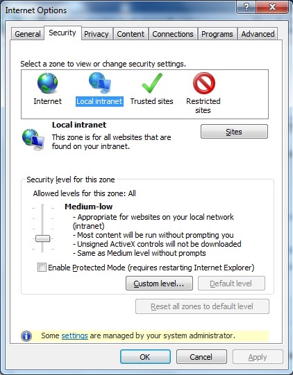
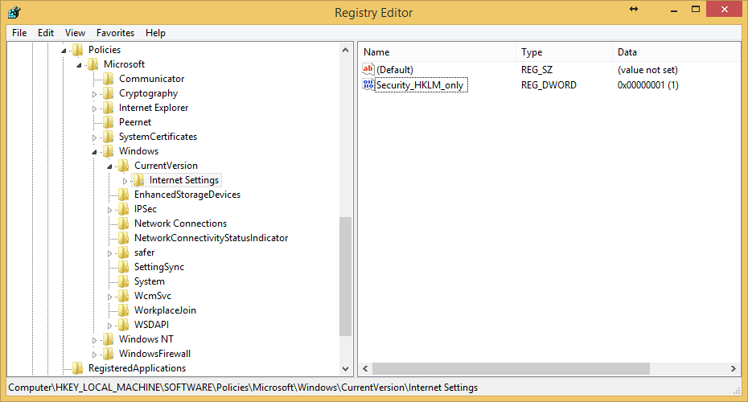
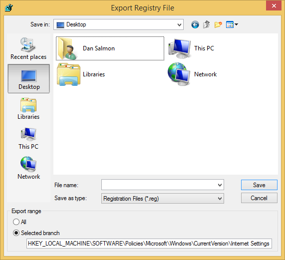

+++
author = "Dan Salmon"
date = 2017-08-26T21:08:00Z
description = ""
draft = false
tags = ["windows"]
slug = "fix-some-settings-are-managed-by-your-system-administrator-in-windows-7"
title = "Fix “Some settings are managed by your system administrator” in Windows 7"
type = "post"

+++

# Background
A few months back, I was doing cleanup on a system that I had cleaned of malware.  Whatever junk was on there had configured a local proxy server to run, but Malwarebytes had ripped it out.  The system unfortunately still thought it was supposed to use the proxy server that doesn’t exist; consequently, I had no internet access. That’s an easy enough fix, right? I open Internet Options and change the LAN settings to not use a proxy and close it. For some reason, every time I would close the window it would re-configure itself to use the proxy. “Was it still infected?” I wondered. Turns out, in the Advanced tab I get this message:

But I am a system administrator? I double-checked this and verified that I was a local admin. Once again it was [TechNet to the rescue](https://social.technet.microsoft.com/Forums/windowsserver/en-US/cd9e1fc2-e209-49f4-ae4a-78222969c6b2/some-settings-are-managed-by-your-system-administrator).

This one's actually very easy to fix.

# Step 1
Open up Registry Editor and navigate to: *HKEY_LOCAL_MACHINE\SOFTWARE\Policies\Microsoft\Windows\CurrentVersion\Internet Settings* and look for a “REG_DWORD” value called "Security_HKLM_only".

# Step 2

I would recommend backing up the key before you delete it just in case something goes wrong when you do this. To back up the key, just navigate to the key and go to "File > Export".

After that, just right-click on the "Security_HKLM_only" value and delete it. You may need to restart the system for it to take effect, but you should be able to edit all Internet Options after that.