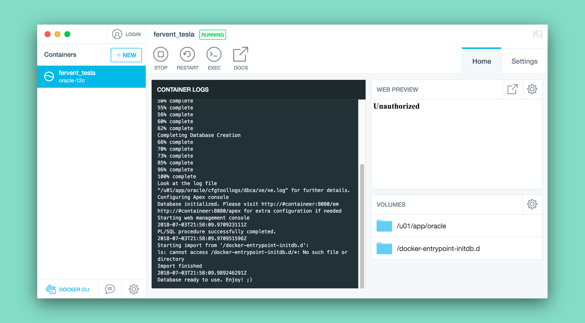
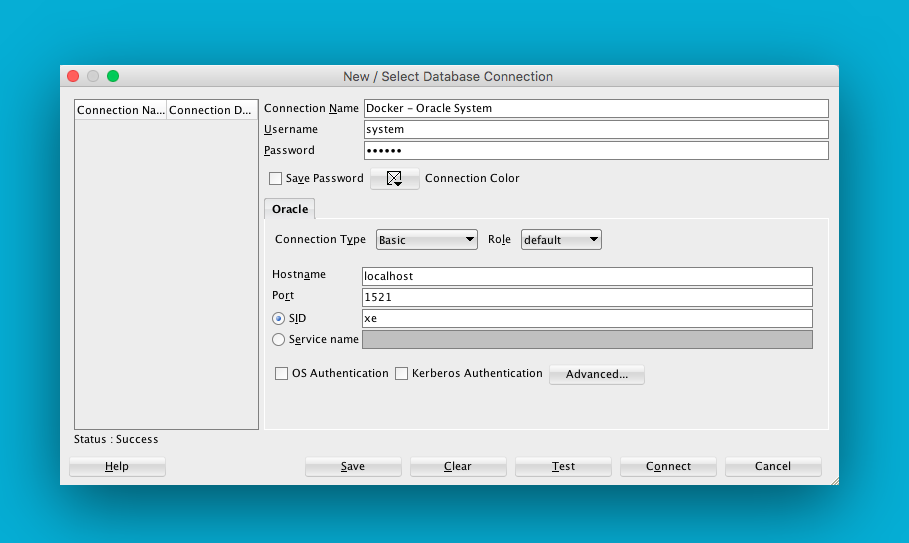

+++
author = "Dan Salmon"
date = 2018-07-05T00:40:32Z
description = "Using Docker, we can run Oracle 12c on MacOS"
draft = false
tags = ["oracle","docker","macOS"]
slug = "running-oracle-12c-on-macos"
title = "Running Oracle 18c on MacOS"
type = "post"
+++

**Update: May 14, 2019** *This article originally contained instructions for running Oracle 12c. The Docker image that was being used was deleted by the author and so was not usable. I have updated the instructions to work again, though the image it uses now runs Oracle 18c. If you need to run 12c specifically, you'll need to look for instructions elsewhere. Some screenshots may now be out of date.*

In this post, we will go through the steps of installing Oracle 12c in a Docker container and connect to the database using SQL Developer on a Mac. This is a much lighter way of running Oracle locally compared to running a full Windows virtual machine with VMWare or Virtualbox. 

### 1. Install Docker

**- If your Mac is newer than 2010**<br>
You can simply install “Docker for Mac”.
Download and install “Docker for Mac” [from here](https://store.docker.com/editions/community/docker-ce-desktop-mac)  (You’ll have to create a quick account to download it. Annoying, I know)
 
**- If your Mac is 2010 or older**<br>
You can still run Docker, but there will be a few extra steps. You’ll install a tool called “Docker Toolbox” which includes everything you need.
Download and install “Docker Toolbox” [here](https://docs.docker.com/toolbox/overview/#ready-to-get-started).
 
### 2. Pull Docker image
* Open the Terminal app and run the following. If you get no errors Docker is installed correctly and running. 

```bash 
docker version
```
   

* Pull the Oracle image by running

```bash
docker pull hothamandcheese/oracle-18.4.0-xe
```

<a target="_blank" rel="noopener noreferer" href="../images/version-pull.png"></a>


### 3. Create container

* First we create a directory outside the Docker container to store the database

```shell
mkdir ~/oracle_data
```

* Then we create a new container with our downloaded image

```docker
docker run -d -p 8080:8080 -p 1521:1521 -e ORACLE_PWD='Password1' -v ~/oracle_data/:/u01/app/oracle hothamandcheese/oracle-18.4.0-xe
```

This should return a long hash string.

<script src="https://asciinema.org/a/PxUXoumtc5GeGKr6UCyVVSRyj.js" id="asciicast-PxUXoumtc5GeGKr6UCyVVSRyj" async></script>
<noscript>[](https://asciinema.org/a/PxUXoumtc5GeGKr6UCyVVSRyj)</noscript>
<noscript>
Scripts are disabled!
</noscript>


* Open Kitematic and find the container we just created.
* Click the "Start" button. The first time you start the container, it will take a 5-10 minutes for the database to build. Just wait until the log reads: **DATABASE IS READY TO USE!**


<a target="_blank" rel="noopener noreferer" href="../images/kitematic.png"></a>


### 4. Install SQL Developer
* Head to [this page](https://www.oracle.com/technetwork/developer-tools/sql-developer/downloads/index.html), click the Agree button and hit Download. You'll have to create a quick account to continue through the download (very annoying, I agree).
* Unzip, drag the app into the Applications folder, and fire it up

### 5. Connect to Oracle database
* In SQL Developer, click the green plus button to create a new connection.
* *If your Mac is 2010 or older:* Get the IP address of your Oracle container by opening Kitematic and switching to the Settings and then Hostname / Ports. Use this in the next step for Hostname.
* The default credentials to connect are as follows:
	* **Connection Name:** Whatever you want. I suggest "Docker - Oracle System"
	* **Username:** system
	* **Password:** Password1
	* **Hostname:** localhost
	* **Port:** 1521
	* **SID:** xe
* When you've filled all that out, hit "Test". If the message in the lower-left corner reads "Status: Success", you've done it correctly. Hit Save and then Connect. If you didn't get a success message, double-check your IP address and username/password combination. 


<a target="_blank" rel="noopener noreferer" href="../images/new-connection.png"></a>


### 6. Creating new databases
* In Oracle 12c, users and databases are essentially the same thing. So to create a new database, we'll create a new user with the following SQL queries, assuming we want to create a database with name "SALES" and password "password". Execute the following in a SQL worksheet

*Change SALES to whatever database name you want*


	CREATE USER SALES
	  IDENTIFIED BY password
	  DEFAULT TABLESPACE USERS
	  TEMPORARY TABLESPACE TEMP
	  QUOTA 200M on USERS;
	 
	GRANT create session TO SALES;
	GRANT create table TO SALES;
	GRANT create view TO SALES;
	GRANT create any trigger TO SALES;
	GRANT create any procedure TO SALES;
	GRANT create sequence TO SALES;
	GRANT create synonym TO SALES;
	


### Potential Problems

* ```IO Error: The Network Adapter could not establish the connection```
   
 This means that you are trying to connect with SQL Developer, but your Docker container is stopped. Open Kitematic, select your Oracle container, and click "Start". When the logs read "Database ready to use. Enjoy! ;)"

