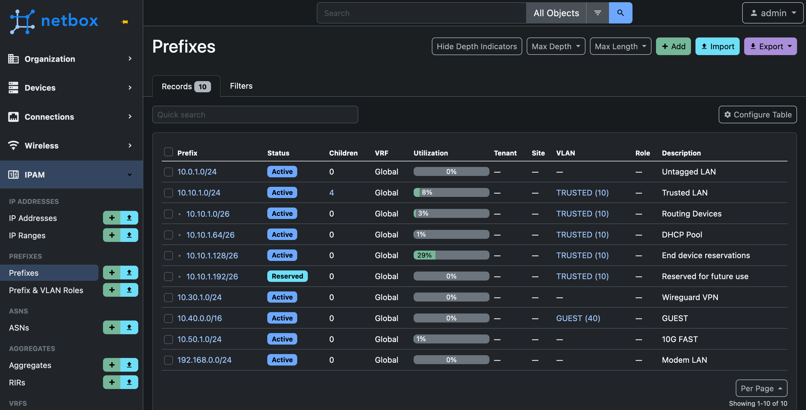

this is some text.

> this is a quote holy moly htis is great asdf lorem ipsum ting to Homebrew - so easy a caveman could do iting to Homebrew - so easy a caveman could do iting to Homebrew - so easy a caveman could do iting to Homebrew - so easy a caveman could. Yes.

# Main Heading 1

lorem ipseum asdkfjasf

## Heading 2

kasdjfkajsdf

### Heading 3

asdfjkjk kj dskjf ksdj fk

- list item 1
- list item 2
- list item 3

1. ordered list 1
1. ordered list 2
1. ordered list 3
1. ordered list 4

This is a reference to [another site](https://google.com) wowee.

Here's a link to [another page](/about) on this site

#### Level 4 Heading formatting

This is _italicized_ text.

This is **bold** text.

### Code

```plaintext
this is a chunk of unformatted text. wowee
```

```golang
func run(int int) error {
    return errors.New("something went wrong");
}
```

## Images

lajsdlf alksdj flkajds flakjsdlkfa sdlkajsdf


Here's a little description of the image.

askdfj apksdj fksaj fksd j


here I am referencing some code like `Warning: GRUB error finding OS not available` and I can't fix this.