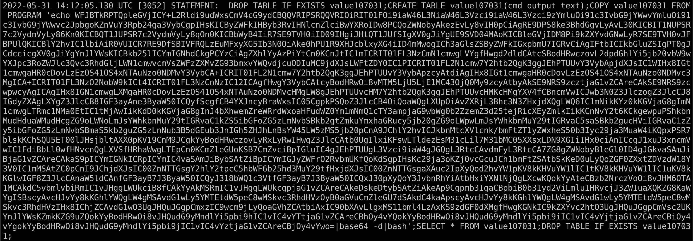

> **Update 2023-06-21**
> 
> This post originally contained some information I now know to be untrue. I got an email yesterday from [Brad Fitzpatrick](https://twitter.com/bradfitz) asking me to take a look at the claims I made about Tailscale.
>
> In my original post, I asserted that any Tailscale user could connect to any other users' machines. I believed this after `nmap`ing a range of CGNAT addresses and seeing up hosts with open ports. In hindsight, I now believe that my ISP at the time (I have since moved) was probably using some of those addresses.
>
> I can't confirm this because I attempted to replicate my scan results today and was unable. I have updated the post accordingly, but if you wish to read the original post, it is archived [here](https://web.archive.org/web/20220624194858/https://danthesalmon.com/ufw-docker-tailscale/).
>
> Apologies to the Tailscale team for any grief this caused - I really do love the product!

<hr>

This is a cautionary tale about something that happened to me in the past few weeks. I'm posting it because I believe a lot can be learned by professionals (and others such as me) posting their security fails and problem-solving processes.

I have a server at Hetzner for a personal project. It's running Ubuntu with Docker and there are a few Docker containers running, Postgres and RabbitMQ among them. Last week I logged into the server to do some work and noticed it was running a bit slow. When I opened `htop` I was shocked to find that this 4-core 8GB server was running at nearly 100% utilization. This was surprising because the average load created by my tinkering is about 30%. It was also surprising because I didn't recognize the name of the process eating up all the resources.

```console
root@scan01:/$ ps aux
USER         PID %CPU %MEM    VSZ   RSS TTY      STAT START   TIME COMMAND
postgres       1  0.0  0.2 213260 22636 ?        Ss   13:14   0:02 postgres
postgres      28  0.0  0.1 213396  8136 ?        Ss   13:14   0:00 postgres: checkpointer
postgres      29  0.0  0.0 213260  5476 ?        Ss   13:14   0:00 postgres: background writer
postgres      30  0.0  0.1 213260  9664 ?        Ss   13:14   0:00 postgres: walwriter
postgres      31  0.0  0.1 213928  8388 ?        Ss   13:14   0:00 postgres: autovacuum launcher
postgres      32  0.0  0.0  67988  5560 ?        Ss   13:14   0:00 postgres: stats collector
postgres      33  0.0  0.0 213696  6424 ?        Ss   13:14   0:00 postgres: logical replication launcher
postgres    3143  0.0  0.0   2412   104 ?        Ssl  14:12   0:00 TvsFUlqh
postgres    3704  0.4  0.0  20544   580 ?        Ssl  14:18   0:27 tracepath
postgres    4508  391 30.2 2443568 2403820 ?     Ssl  14:25 409:05 4tn6Cn6Q
root       10975  0.0  0.0   7092  3740 pts/0    Ss   16:05   0:00 bash
root       11606  0.0  0.0   9692  3216 pts/0    R+   16:09   0:00 ps aux
```

Digging into it a bit, I found that this process was not running on the Ubuntu host, but rather in the Postgres container. As a security researcher, I will admit I was excited by this. A real-life intrusion - on my box! And it's not even (intentionally) a honeypot! I really wanted to know a few things about this hack:

- How did they get in
- What were they doing with my poor server

I knew from the little I've read about the DFIR process that I shouldn't just nuke this container immediately but should capture as much evidence as I can first. Hopefully there are some clues in there about what's going on. I had no idea the best way to go about this (I'm a pentester by trade) - the only forensics training I've had was about dissecting full system and memory dumps with Autopsy and Volatility. I didn't know how to actually capture these dumps and I also wanted to minimize the time my box was being used for malicious purposes. So after googling around a little and consulting my friend [C4pr1c0](https://twitter.com/C4pr1c0) who does a lot of research into Docker botnets, I did the following:

- Saved an image of the container with `docker export`
- Saved a diff of the container with `docker diff`
- Captured traffic on both the `eth0` and `tailscale0` interfaces with `tcpdump`
- Tried to find the binary that was running with `find` to no avail

It seemed like the malware had either deleted any files it had dropped after it ran, or had never hit the disk in the first place

```
root@scan01:~# ls -alh /proc/4508/exe
lrwxrwxrwx 1 systemd-coredump systemd-coredump 0 May 31 15:43 /proc/4508/exe -> '/var/lib/postgresql/data/08d28c02e5a9bfed60e333377fc8189d (deleted)'
```

Looking through the postgres container logs, there were hundreds of authentication attempt logs going back a few days. Scrolling past those, I then found a huge query that had failed to run:




I immediately recognized the text blob as base64 text due to the equal sign padding at the end - then I realized that it gets piped to `base64 --decode`. Also a pretty clear indicator. Decoding this yields the following shell script: https://gist.github.com/sa7mon/f5f36237b44e984bf311bc50949513c6

In short, the attacker utilized the Postgres `COPY` command with the `FROM COMMAND` argument to call shell commands in the container as the `postgres` user. The script pulls down some required tools like a pre-compiled curl binary then uses it to download 3 payloads hosted on a Tor server, but accessed via Tor2web on the clearnet. Unfortunately, by the time I had gotten this far the payload URLs returned 404 errors so I didn't get any further.

In the tcpdump logs, I could see a ton of SSH traffic to tons of IP addresses. My guess is the attacker was using my machine to either just scan and fingerprint SSH servers or to actively bruteforce them. 

After my evidence gathering was complete, I killed the container and started looking at how the attacker may have gotten in. The Postgres container that had been compromised was part of a `docker-compose` config that brought up the service with port 5432 mapped to the host and just used the default credentials. This seemed fine because only the localhost can access Docker mapped ports.

Now is probably a good time to mention that this box also has UFW installed. The UFW rules I had configured looked like this:

```
$ sudo ufw status verbose
Status: active
Logging: on (low)
Default: deny (incoming), allow (outgoing), deny (routed)
New profiles: skip

To                         Action      From
--                         ------      ----
Anywhere on tailscale0      ALLOW IN    Anywhere
41641/udp                   ALLOW IN    Anywhere
22/tcp                      ALLOW IN    Anywhere
Anywhere (v6) on tailscale0 ALLOW IN    Anywhere (v6)
41641/udp (v6)              ALLOW IN    Anywhere (v6)
22/tcp (v6)                 ALLOW IN    Anywhere (v6)
```

The UFW rules seemed fine so I brought the container back up, watched it for a few minutes to make sure no one broke in, and called it a day.

4-5 days later I received an email from Hetzner with the subject `Abuse Message [AbuseID:XXXXX]: NetscanOutLevel: Netscan detected from x.x.x.x` (my Hetzner public IP). In the email it said that my box was doing tons of malicious scanning of machines on port 8081 and that if I didn't knock it off, they would block network access from my server. Ugh, again?

I quickly connected to the box and immediately killed the container this time. No time to grab evidence because Hetzner is mad at me and I don't want to get banned from their service. So how did the container get compromised again?

Time to take another look at my UFW rules. I `nmap`'d my Hetzner public IP to verify that only port 22 was open, but saw that my RabbitMQ port (the only other container running) was connectable from the internet.

```
$ nmap -Pn -sV -p 15672 100.94.26.5
Starting Nmap 7.92 ( https://nmap.org ) at 2022-06-10 17:50 CDT
Discovered open port 15672/tcp on 100.94.26.5
Scanned at 2022-06-10 17:50:36 CDT for 11s

PORT      STATE SERVICE REASON  VERSION
15672/tcp open  http    syn-ack Cowboy httpd
```

wtf? 

(If you are more knowledgeable with Docker than I am, which is likely, you probably already know what's going on.)

After searching for "ufw + docker" I quickly found a lot of people asking the same question I was. I soon learned that by default Docker manipulates `iptables` to control network traffic between the host and containers. UFW also manipulates `iptables` rules (it's essentially a frontend for `iptables`). It turns out Docker and UFW don't play well together for this reason. 

There were actually 2 problems with my setup at this point - none of the UFW rules were properly applying and the Docker container ports which were mapped to the host were being bound to -all- interfaces. This is default Docker behavior I was unaware of; if your box is not behind a firewall or at least NAT'd behind a router, that port is now open to the internet.

The fix for the firewall rules problem is actually pretty simple and Docker [has documentation](https://docs.docker.com/network/iptables/) around it: just edit `/etc/docker/daemon.json` to include `{"iptables": false}` and restart Docker. I did this, but for some reason Docker threw an error after I made the change and did a `service docker restart`. `journalctl` was no help, but the daemon started up fine with `dockerd -debug` so I ended up just restarting the server. After it came back up, Docker was running perfectly with the `iptables` changes intact.

After a quick `nmap` I was able to confirm the mapped ports were not accessible outside the box. I ended up not mapping any container ports to the host and just let the containers communicate directly, but Docker does allow you to bind a mapped container port to a single interface with `-p IP:host_port:container_port`.


**Lessons learned:**

- Hetzner is a great cloud provider and I'm glad they're proactive about kicking malicious users off their platform. If you want to try them out, you can use [this referral link](https://hetzner.cloud/?ref=V9TzL9Jf56Ge) for €20 in cloud credits
- Docker and ufw do not play nice together by default
- Even if I'm just spinning up a test container, I should probably change default creds
- If a container doesn't need its ports mapped to the docker host, don't map them. Just let the containers communicate with each other directly.
- If I do map ports to the host, I need to pay attention to which interface that port binds to.