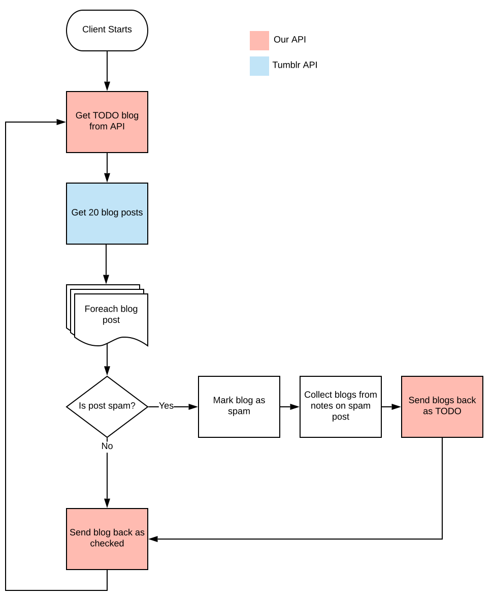

+++
author = "Dan Salmon"
date = 2020-03-08T00:00:00Z
description = "An attempt to quantify the Tumblr spam problem"
draft = false
tags = ["research", "tumblr"]
slug = "tumblr-has-a-spam-problem"
title = "Tumblr Has a Spam Problem"
type = "post"
+++

I have an account on Tumblr, though I seem to be one of the few people still on the site. Over the past few years, I've noticed an uptick in the amount of spam accounts following me. A considerable increase, in fact, so I decided to try to quantify how pervasive the problem was.

## Searching for Spam

The first thing I had to do was create some criteria to use for categorizing accounts as "spam". With a few variations, here are the distinguishing features of a spam account:

* The majority of posts by the account are reblogs of posts from other spam accounts
* The reblogged posts are either risque photos of women or ads for seedy mobile games
* The URL or account name of the blog is either complete gibberish or the name of an account that was previously active, but got deactivated. That old account most likely had a few popular posts with lots of notes.
* If the post was an image of a woman, the caption was usually in the format "Name (number Images)". i.e. "Natalie (30 Images)"
* Any link in the body of the post used a URL shortening service such as bit[.]ly or j[.]mp

Here is an example of a pretty typical post:


I began to look just for posts that had that text format of "Name (number Images)", but it didn't account for all scenarios because the posts would sometimes use other words instead of "images" such as "selfies" or "videos" or sometimes they would just have the name alone.

Some of the posts didn't feature women at all, but instead advertised seedy mobile games:


I decided I would focus my search on posts that contained shortened links because regular users don't generally use link shortening services. This may be a generalization, but in practice it yielded a very low false positive rate.

Utilizing the Tumblr API, I was able to get back the HTML source of any post I wanted to classify as spam or non-spam. If any one of the following criteria are met, the account is classified as spam:

* Photo caption matches the regex pattern:
    ```
    <a href=.+(bit\.ly|j\.mp).+><h1>.+<\/h1><\/a>
    ```
* Publisher field contains a URL within the j.mp or bit.ly domain
* Source field contains a URL within the j.mp or bit.ly domain

The "publisher" and "source" fields are user-editable fields that add links to your post.

## Process

I saw this project as a good chance to try out Django and learn about building a distributed application with an API and client application. Functionally, the two operated similar to a spider with the worker client querying the Tumblr API and sending data back to the API to store. The API in turn would then hand work to do back to the client. 

The flow looked something like this:

1. The client queries our API for the name of a blog to check
2. The client queries the Tumblr API for the latest 20 posts for this blog. Why 20 posts? Because that's the maximum number of posts the Tumblr API returns with one request and there's a daily limit of API requests we can make.
3. For each blog post, compare it against our list of criteria. If we determine the post is spam:
    * Send a request back to our API marking this blog as spam in the database
    * Collect the names of blogs that interracted with this spam post by checking the notes (who liked it and who reblogged it)
    * Send these blog names back to our API as TODO items
4. Send a request back to our API marking that blog as checked, and start the process back over at Step 1.

Or for those who prefer a more visual explanation:

<!--  -->


## Results & Conclusion

Time for the numbers: 

* Total blogs checked: `4,647,267`
* Non-spam blogs: `4,449,854`
* Spam blogs: `197,413`

and here are the criteria that were hit:

* bitly or jmp publisher: `29,488`
* bitly or jmp source: `118,694`
* photo caption regex: `19,846`
* other: `29,384`

(The "other" category is due to me not storing in the database what criteria was matched when I first started the project.)

I was able to find nearly 200,000 spam accounts with my simple searching methods. I am certain there are far more than this if I would have kept the application running indefinitely. 

I should note that it would be inaccurate for someone to look at those numbers and extrapolate that about 4% of all Tumblr accounts are spam. The accounts I was looking at were not chosen at random, but rather were analyzed because they interacted with a suspected spam account. 

Maybe it's due to the internal turmoil that comes from being bought and sold twice in 6 years, but it really seems like Tumblr is not doing a great job at curbing the spam problem.

#### P.S. 

If you're at all interested in the data, I've put the list of identified spam accounts in a git repo here: [https://github.com/sa7mon/tumblr-spam-accounts](https://github.com/sa7mon/tumblr-spam-accounts)
